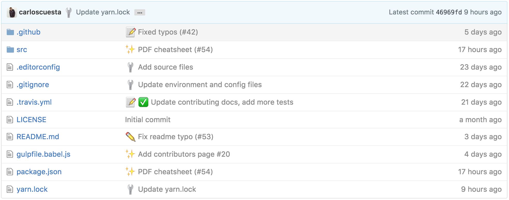
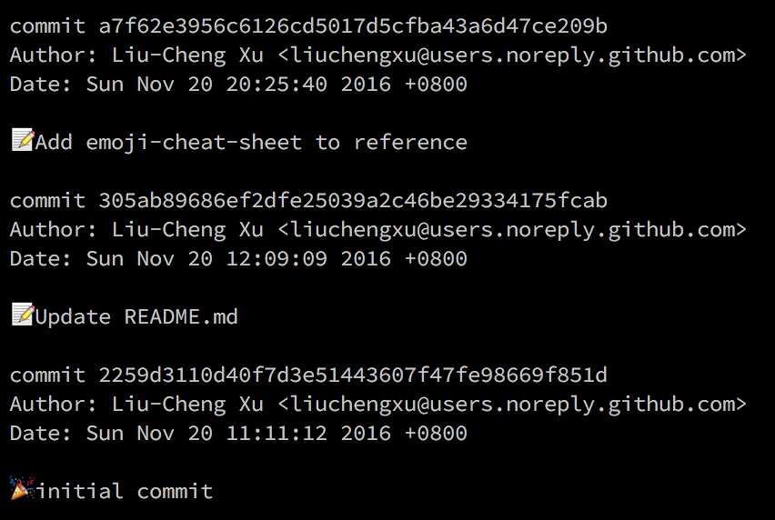

git commit emoji 使用指南
============================

#### 目录

<!-- vim-markdown-toc GFM -->

* [commit 格式](#commit-格式)
* [emoji 指南](#emoji-指南)
* [如何在命令行中显示 emoji](#如何在命令行中显示-emoji)
* [参考](#参考)
  * [git commit emoji](#git-commit-emoji)
  * [write a good commit message](#write-a-good-commit-message)

<!-- vim-markdown-toc -->

执行 `git commit` 时使用 emoji 为本次提交打上一个 "标签", 使得此次 commit 的主要工作得以凸现，也能够使得其在整个提交历史中易于区分与查找。

截取的 [gitmoji](https://github.com/carloscuesta/gitmoji) 快照:



### commit 格式

`git commit` 时，提交信息遵循以下格式：

```sh
:emoji1: :emoji2: 不超过 50 个字的摘要，首字母大写，使用祈使语气，句末不要加句号

提交信息主体

引用相关 issue 或 PR 编号 <#110>
```

初次提交示例：

```sh
git commit -m ":tada: Initialize Repo"
```

### emoji 指南

emoji                                   | emoji 代码                   | commit 说明
:--------                               | :--------                    | :--------
:tada: (庆祝)                           | `:tada:`                     | 初次提交
:new: (全新)                            | `:new:`                      | 引入新功能
:bookmark: (书签)                       | `:bookmark:`                 | 发行/版本标签
:bug: (bug)                             | `:bug:`                      | 修复 bug
:ambulance: (急救车)                    | `:ambulance:`                | 重要补丁
:globe_with_meridians: (地球)           | `:globe_with_meridians:`     | 国际化与本地化
:lipstick: (口红)                       | `:lipstick:`                 | 更新 UI 和样式文件
:clapper: (场记板)                      | `:clapper:`                  | 更新演示/示例
:rotating_light: (警车灯)               | `:rotating_light:`           | 移除 linter 警告
:wrench: (扳手)                         | `:wrench:`                   | 修改配置文件
:heavy_plus_sign: (加号)                | `:heavy_plus_sign:`          | 增加一个依赖
:heavy_minus_sign: (减号)               | `:heavy_minus_sign:`         | 减少一个依赖
:arrow_up: (上升箭头)                   | `:arrow_up:`                 | 升级依赖
:arrow_down: (下降箭头)                 | `:arrow_down:`               | 降级依赖
:zap: (闪电)<br>:racehorse: (赛马)      | `:zap:`<br>`:racehorse:`      | 提升性能
:chart_with_upwards_trend: (上升趋势图) | `:chart_with_upwards_trend:` | 添加分析或跟踪代码
:rocket: (火箭)                         | `:rocket:`                   | 部署功能
:white_check_mark: (白色复选框)         | `:white_check_mark:`           | 增加测试
:memo: (备忘录)<br>:book: (书)          | `:memo:`<br>`:book:`          | 撰写文档
:hammer: (锤子)                         | `:hammer:`                   | 重大重构
:art: (调色板)                          | `:art:`                      | 改进代码结构/代码格式
:fire: (火焰)                           | `:fire:`                     | 移除代码或文件
:pencil2: (铅笔)                        | `:pencil2:`                  | 修复 typo
:construction: (施工)                   | `:construction:`             | 工作进行中
:wastebasket: (垃圾桶)                  | `:wastebasket:`              | 废弃或删除
:wheelchair: (轮椅)                     | `:wheelchair:`               | 可访问性
:construction_worker: (工人)            | `:construction_worker:`      | 添加 CI 构建系统
:green_heart: (绿心)                    | `:green_heart:`              | 修复 CI 构建问题
:lock: (锁)                             | `:lock:`                     | 修复安全问题
:whale: (鲸鱼)                          | `:whale:`                    | Docker 相关工作
:apple: (苹果)                          | `:apple:`                    | 修复 macOS 下的问题
:penguin: (企鹅)                        | `:penguin:`                  | 修复 Linux 下的问题
:checkered_flag: (旗帜)                 | `:checkered_flag:`           | 修复 Windows 下的问题
:twisted_rightwards_arrows: (交叉箭头)   | `:twisted_rightwards_arrows:`| 分支合并
:robot: （机器人)                        | `:robot:`                    | 修复 Android 下的问题
:green_apple: （苹果)                    | `:green_apple:`              | 	修复 IOS下的问题
:pushpin: （图钉)                    | `:pushpin:`              | 	依赖固定到特定版本
:recycle: （回收)                    | `:recycle:`              | 	添加 CI 构建系统
:package:(包裹)                  | `:package:`                 | 更新编译文件或Package        
:alien: (外星人)                | `:alien:`                   | 由于外部API的更改而更新了代码 
:truck: (卡车)                   | `:truck:`                   | 移动或重命名文件            
:page_facing_up:(文件)           | `:page_facing_up:`          | 添加或更新 Licence             
:boom: (隆隆声)                 | `:boom:`                    | 引入重大变化                  
:bento: (便当)                   | `:bento:`                   | 添加或更新 Assets              
:ok_hand:(OK)                      | `:ok_hand:`                 | 由于代码评审更改而更新代码 
:wheelchair: (轮椅)              | `:wheelchair:`              | 提高可访问性                  
:bulb: (电灯泡)                 | `:bulb:`                    | 记录源代码                     
:beers: (啤酒)                   | `:beers:`                   | 醉醺醺地编写代码            
:speech_balloon: (发言)          | `:speech_balloon:`          | 更新文本和文字               
:card_file_box: (文件盒)        | `:card_file_box:`           | 执行与数据库相关的更改   
:loud_sound: (巨大声响)        | `:loud_sound:`              | 添加日志                        
:mute: (静音)                    | `:mute:`                    | 移除日志                        
:busts_in_silhouette: (轮廓半身像) | `:busts_in_silhouette:`     | 添加贡献者                     
:children_crossing: (儿童通过) | `:children_crossing:`       | 提高用户体验/可用性        
:building_construction: (房屋)   | `:building_construction:`   | 使建筑变化                     
:iphone: (苹果手机)            | `:iphone:`                  | 致力于响应式设计            
:clown_face: (小丑)              | `:clown_face:`              | Mock 相关                         
:egg:(彩蛋)                      | `:egg:`                     | 加入一个复活节彩蛋         
:see_no_evil:(非礼勿视)        | `:see_no_evil:`             | 添加或更新 .gitignore 文件   
:camera_flash: (相机)            | `:camera_flash:`            | 添加或更新快照               
:alembic: (蒸馏器)              | `:alembic:`                 | 尝试新事物                     
:mag: (放大镜)                  | `:mag:`                     | SEO 提升                          
:wheel_of_dharma: (达摩车轮)   | `:wheel_of_dharma:`         | Kubernetes 相关工作            
:label: (标签)                   | `:label:`                   | 添加或更新 types (Flow, TypeScript) 
:seedling: (种子)                | `:seedling:`                | 添加或更新种子文件         
:triangular_flag_on_post: (旗帜) | `:triangular_flag_on_post:` | 添加、更新或删除功能标志 
:dizzy: (头昏眼花)             | `:dizzy:`                   | 添加或更新动画和转换      

### 如何在命令行中显示 emoji

默认情况下，在命令行中并不会显示出 emoji, 仅显示 emoji 代码。不过可以使用 [emojify](https://github.com/mrowa44/emojify) 使得在命令行也可显示 emoji, 它是一个 shell 脚本，安装与使用都很简单，在 [这里](https://github.com/mrowa44/emojify) 查看如何安装与使用。



### 参考

#### git commit emoji

- [gitmoji](https://github.com/carloscuesta/gitmoji/)
- [emoji-cheat-sheet](http://www.webpagefx.com/tools/emoji-cheat-sheet/)
- [styleguide-git-commit-message](https://github.com/slashsBin/styleguide-git-commit-message)
- [atom git commit messages guide](https://github.com/atom/atom/blob/master/CONTRIBUTING.md#git-commit-messages)
- [An emoji guide for your commit messages](https://gitmoji.carloscuesta.me/)
- [程序员提交代码的 emoji 指南——原来表情文字不能乱用](https://www.h5jun.com/post/gitmoji.html)
- [Ant Design 更新日志 emoji 规范](https://github.com/ant-design/ant-design/wiki/%E8%BD%AE%E5%80%BC%E8%A7%84%E5%88%99%E5%92%8C%E7%89%88%E6%9C%AC%E5%8F%91%E5%B8%83%E6%B5%81%E7%A8%8B#emoji-for-changelog)

#### write a good commit message

- [A Note About Git Commit Messages](http://tbaggery.com/2008/04/19/a-note-about-git-commit-messages.html)
- [How to write a Git Commit Message (2014)](https://news.ycombinator.com/item?id=13889155)
- [how to write a good git commit message](https://github.com/joelparkerhenderson/git_commit_message)
- [5 Useful Tips For A Better Commit Message](https://robots.thoughtbot.com/5-useful-tips-for-a-better-commit-message)
- [Udacity Git Commit Message Style Guide](http://udacity.github.io/git-styleguide/)
- [How to commit a change with both “message” and “description” from the command line?](https://stackoverflow.com/questions/16122234/how-to-commit-a-change-with-both-message-and-description-from-the-command-li)
